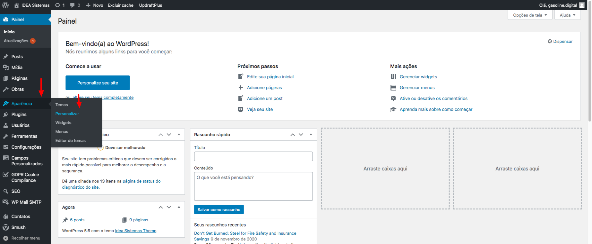
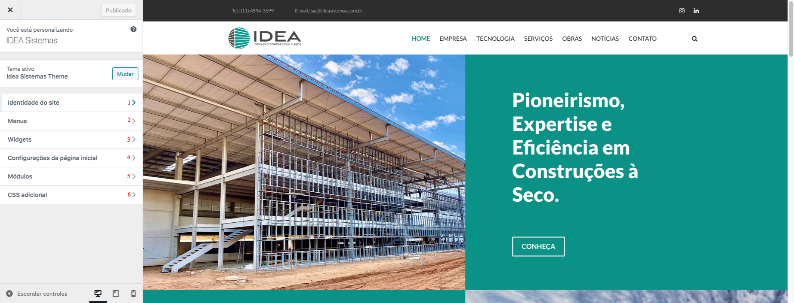
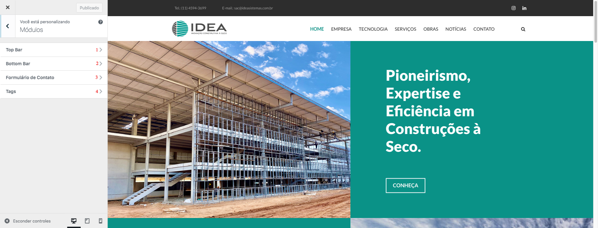
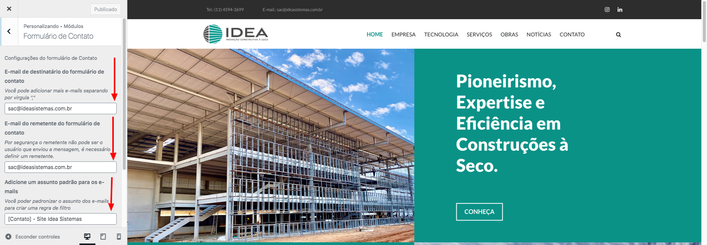
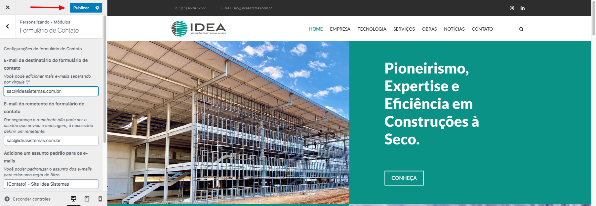
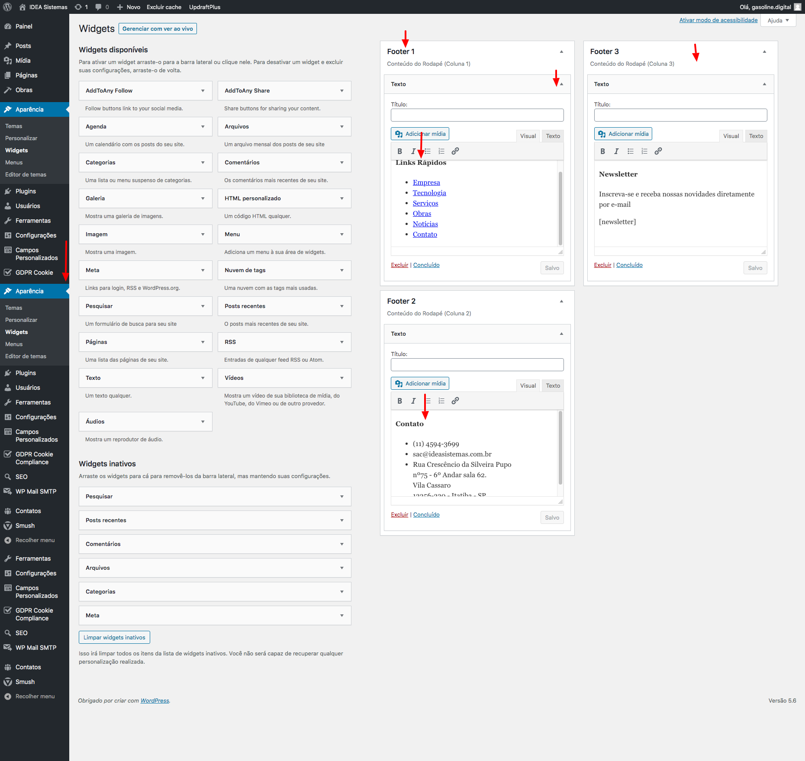
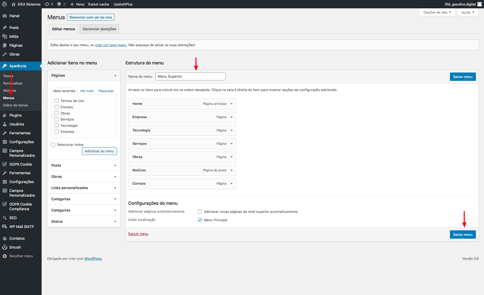
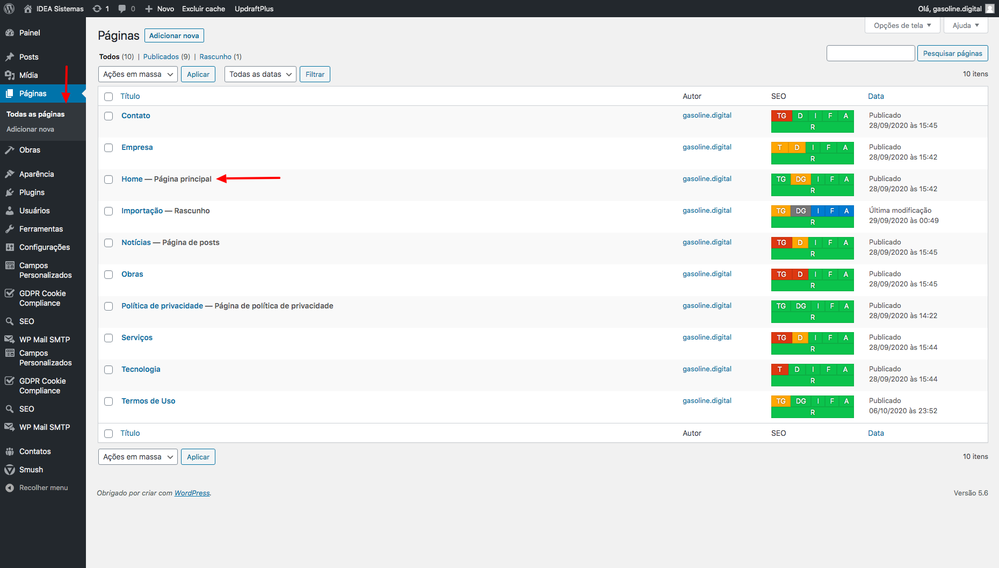
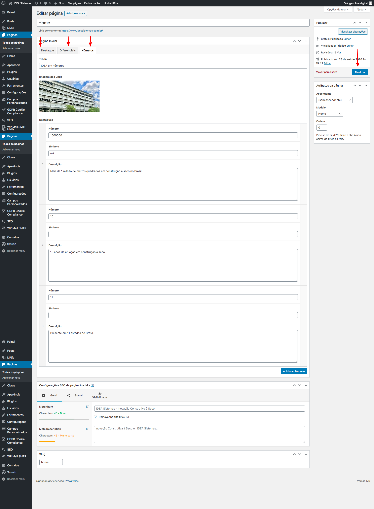

## Bem vindo(a) a página de ajuda do site ideasistemas.com.br

O objetivo desta página é oferecer uma ajuda rápida e permanente para as principais dúvidas em relação a administração de conteúdo do site através do Wordpress.

Caso a sua dúvida não seja atendida através dos tópicos abaixo, por favor encaminhe a sua questão para o e-mail: suporte@gasoline-digital.com

### Como alterar o conteúdo da topbar, logo da empresa, configurações do formulário de contato, entre outros
Através da personalização de site, é possível alterar diversas configurações e informações do site, vide abaixo.

*Acesso a função personalizar no menu.*

*Opções de personalização.*

Depois de acessar a página de personalização, irá abrir as opções, sendo elas.:

**1) Identidade do site:**
Através desta opção você pode alterar a logomarca da empresa no site.

**5) Módulos:**
Acesso a personalização dos módulos de formulário de contato, topbar entre outros.

**6) CSS Adicional:**
Possibilidade de inclur códigos css para customizar o site.

*Módulos.*

Depois de acessar a página de módulos, irá abrir as opções, sendo elas.:

**1) TopBar:**
Através desta opção você pode trocar os links das redes sociais, e-mail, e número de telefone.

**2) BottomBar:**
Através desta opção você pode trocar os links de política de privacidade, termos de uso e texto de copyright.

**3) Formulário de Contato:**
Através desta opção você pode trocar o e-mail de destino do formulário de contato.

**4) Tags:**
Através desta opção você pode trocar a tag do google analytics.

*Módulo Formulário de Contato.*

Exemplo da tela de edição, após efetuar as alterações, clicar "Publicar", vide imagem abaixo.:

*Módulo Formulário de Contato- Publicar.*

### Rodapé
Através da funcionalidade Widgets você pode trocar todo o conteúdo do rodapé do site, vide print abaixo.

*Indicações de como alterar o conteúdo do rodapé.*

### Itens do Menu superior
Através da funcionalidade "Menu", você pode adicionar, exlcuir, ou altera um item do menu superior, vide print abaixo.:

*Indicações de como alterar os itens do menu superior.*

### Conteúdo das páginas
O Wordpress permite você alterar todos os conteúdos das páginas, vide abaixo.:

*Na opção páginas no menu latera, você acessa o cadastro de todas as páginas do site, e ao clicar em editar, abre o formulário de edição.*

*Formulário de edição de páginas*

No formulário de edição de páginas, você pode alterar todo o conteúdo das páginas, assim também como adicionar um novo conteúdo, o exemplo acima ilustra como alterar os números da página inicial, no bloco "IDEA em números".

### Suporte ou Contato
Caso tenha alguma outra dúvida, você pode acionar o nosso suporte através do e-mail: suporte@gasoline-digital.com
